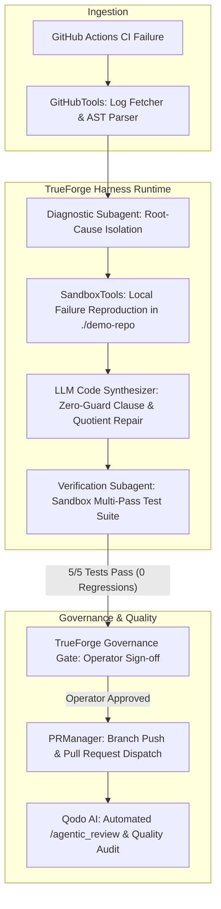

# 🏛️ AutoFix-Agent Architecture Blueprint

> Technical Specification & Component Topology for **The Agent Harness Hackathon** (WeMakeDevs × TrueFoundry × Qodo).

---

## 1. High-Level System Flow

AutoFix-Agent transforms raw LLMs into deterministic, enterprise-grade software engineering agents by enforcing a 6-state execution loop managed by the **TrueForge Agent Harness**:



---

## 2. Directory Layout & Module Responsibilities

```
autofix-agent/
├── .github/
│   └── workflows/
│       └── ci.yml                 # Automated CI test pipeline for repo integrity
├── demo-repo/                     # Isolated sandbox workspace for test reproduction & patching
│   ├── src/
│   │   └── calculator.js          # Sandboxed target code module
│   └── test/
│       └── calculator.test.js     # Sandboxed test suite (5 assertions)
├── dist/                          # Production runtime artifacts
│   ├── demo_runner.js             # Standalone CLI execution harness
│   └── server.js                  # Zero-dependency local dashboard HTTP server
├── docs/                          # Submission documentation & field reports
│   ├── ARCHITECTURE.md            # Technical component breakdown (this document)
│   ├── DEMO_SCRIPT.md             # 3-minute timed screen recording walkthrough
│   ├── FIELD_REPORT.md            # Publication-ready technical case study
│   └── SUBMISSION_CHECKLIST.md    # Multi-track qualification checklist
├── public/
│   └── index.html                 # Mission Control Web UI (File TF-007 theme)
├── src/                           # TypeScript Core Engine
│   ├── agent/
│   │   ├── harness.ts             # TrueForge state machine & governance gate
│   │   ├── subagents.ts           # Diagnostic, Verification & Qodo PR subagents
│   │   ├── session_store.ts       # Persistent SQLite/JSON session storage
│   │   ├── repair_loop.ts         # Orchestration pipeline
│   │   ├── prompts.ts             # Zero-guard system prompts
│   │   └── types.ts               # State & telemetry interfaces
│   ├── github/
│   │   └── pr_manager.ts          # Pull Request payload builder & Qodo trigger
│   ├── tools/
│   │   ├── sandbox_tools.ts       # Isolated sandbox runner (execFile with process.execPath)
│   │   ├── github_tools.ts        # Runner log ingestion & stack trace extractor
│   │   ├── mcp_server.ts          # Model Context Protocol standardized tool schemas
│   │   └── index.ts               # Tool registry exports
│   ├── colors.ts                  # ANSI terminal formatting
│   └── config.ts                  # Environment variable configuration
├── .env.example                   # Environment configuration template
├── .gitignore                     # Git exclusion rules
├── LICENSE                        # MIT License
├── package.json                   # Dependency declarations & scripts
├── README.md                      # Primary project documentation & Qodo evidence
└── tsconfig.json                  # TypeScript compiler options
```

---

## 3. Core Primitives Implemented

### A. TrueForge State Machine (`src/agent/harness.ts`)
* Implements 6 deterministic states: `ANALYZING`, `REPRODUCING`, `PATCHING`, `VERIFYING`, `AWAITING_APPROVAL`, and `COMPLETED`.
* Guarantees that no remote git operations occur without transitioning through verified sandbox states.

### B. Isolated Sandboxing (`src/tools/sandbox_tools.ts`)
* Uses `execFile` with `process.execPath` to ensure 100% cross-platform parity across Windows, macOS, and Linux without polluting host systems.

### C. Persistent Session Store (`src/agent/session_store.ts`)
* Durably persists session snapshots to `.trueforge/sessions.json`, allowing multi-step resumes and audit trail inspection.

### D. Model Context Protocol (MCP) Schemas (`src/tools/mcp_server.ts`)
* Standardized tool contracts exposed for agent discovery: `github_fetch_ci_logs`, `sandbox_reproduce_test`, `sandbox_apply_patch`, and `governance_request_human_approval`.

### E. Qodo Code Review Audit (`src/github/pr_manager.ts`)
* Direct integration with `@qodo-code-review` bot triggers (`/agentic_review`, `/describe`, `/improve`) to maintain automated code quality validation.
